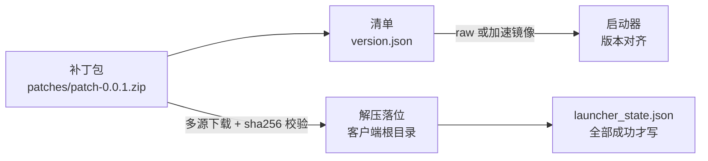

# 葉子仙境 · 补丁通道（测试样本仓库）

> RO2026 整合版**启动器**的补丁分发通道。本仓库为**测试样本**，
> 用于验证「补丁发布 → 启动器拉取 → 校验落位」整条链路，**不是正式发布通道**。

对外只提供两样东西：一份**清单**（`version.json`）和一个**补丁包**（`patches/patch-<ver>.zip`）。

---

## 它验证什么链路



启动器可用 `--headless` 无界面跑完整流程并输出 JSON 报告，所以这个仓库同时也是端到端验收的靶场。

---

## 仓库布局

```
version.json              启动器读取的清单（唯一入口）
patches/patch-<ver>.zip   补丁包（条目名 = 客户端相对路径镜像，UTF-8 / flag 0x800）
.gitattributes            *.zip binary —— 必须，否则 CRLF 转换会改写字节、破坏 sha256 与 zip 结构
launcher/RoLauncher.exe   （可选）随通道附带一份启动器
```

清单地址（raw）：

```
https://raw.githubusercontent.com/g4yzx/ro2026-patch-test/main/version.json
```

---

## 清单契约（`version.json`）

| 字段 | 含义 |
| --- | --- |
| `base` | 基线客户端版本（`20260219`） |
| `latest` | 最新补丁版本号；`patches` 末项的 `ver` 必须与之相等 |
| `minLauncher` | 能消费本清单的启动器最低版本 |
| `origin` | 清单与补丁包的**基址**；`patches[].url` 相对它给出 |
| `mirrors` | 顺序回退的**前缀**，拼在 `origin` 之前；末项必须为空串（= 直连） |
| `patches[]` | `ver` / `url` / `sha256` / `size`，按版本升序 |

补丁包的**最终地址**按如下规则解析：

```
for m in mirrors（按顺序尝试）:
    candidate = m + origin + url
    下载成功 且 sha256 匹配  →  采用该源，停止
```

因为拼接方式是「**前缀式**」（`mirror + origin + url`），本通道只能接入**前缀型**镜像；
「换域名」型镜像（如 `raw.gitmirror.com`）与之不兼容，无法接入。

---

## 多源与国内可达性

两套机制**缺一不可** —— 清单自己需要一套，补丁包需要另一套（否则是鸡生蛋问题）：

| 机制 | 覆盖对象 | 位置 | 热更 |
| --- | --- | --- | --- |
| 清单**引导镜像** | `version.json` 本身 | 启动器内置的候选前缀 | ❌ 需重发启动器 |
| 清单内 `mirrors` | 补丁包 zip | `version.json` | ✅ 改清单即生效 |

启动器遇到 `raw.githubusercontent.com` 的清单地址会**自动展开**加速前缀，顺序为：

```
gh-proxy.com  →  ghfast.top  →  ghproxy.net  →  裸 raw（直连兜底）
```

实测三个前缀在国内直连均可用，且比裸 raw 更快更稳，故排在裸 raw 之前；
境外同样可用，因此该顺序不会让境外用户变慢。

---

## 体积上限与正式分发

- **GitHub 仓库单文件硬上限 100 MB** ⇒ 正式补丁包（约 122 MB）**不能**提交进仓库，
  必须作为 **Release 资产**分发（单文件上限 2 GB）；此时 `origin` 指向对应的
  `releases/download/<tag>/`。
- 本测试仓库的样本包仅约 **0.22 MB**，可直接进仓库、走 raw 直链，便于秒级迭代。
- 仓库必须 **public** —— 启动器面向玩家运行、不内置任何凭据，
  private 仓库的 raw 地址会要求 token 从而拉取失败。

---

## 版本号约定

- 测试样本固定用 **`0.0.1`**，正式版本从 **`1.0.1`** 起步。
- 好处：即使客户端误配到测试清单，本地版本也已高于远端，只会判为 `LocalAhead`
  （不降级、不误更新）。

---

## 本仓库如何生成

本仓库内容由构建侧脚本自动产出（`git_channel.py`：写入 `version.json`、复制补丁包、
生成 `.gitattributes` 与本文档 → `git init` → 提交 → 推送 → clone 自校验）。

> ⚠️ `version.json`、`.gitattributes` 与**本 README 都是生成物**，
> 手工改动会在下次发布时被覆盖 —— 需要改文案请改生成模板。

---

## 相关工程

| 组件 | 说明 |
| --- | --- |
| 启动器 | 单文件自包含（.NET 6 / win-x64），玩家侧零依赖、不弹 UAC、双击即用 |
| manifest 契约 | 三段：`patch_files.tsv` → `patch-<ver>.zip` → `version.json` |
| 构建侧 | `t01_diff_survey.py`（差分）、`build_patch.py`（打包 + 解压回归自校验）、`make_version_json.py`（出清单） |
| 验收 | `e2e_run.py`（8 场景）、`verify_git_channel.py` / `verify_remote_channel.py`（真实远端链路） |
